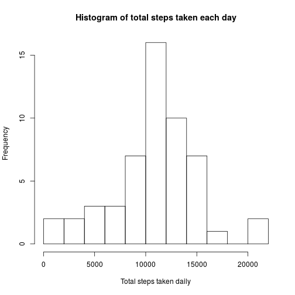
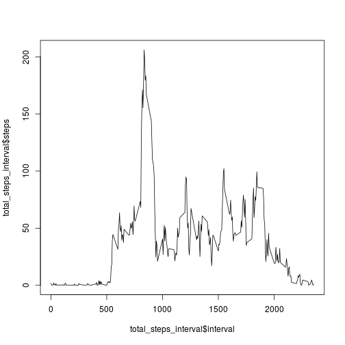
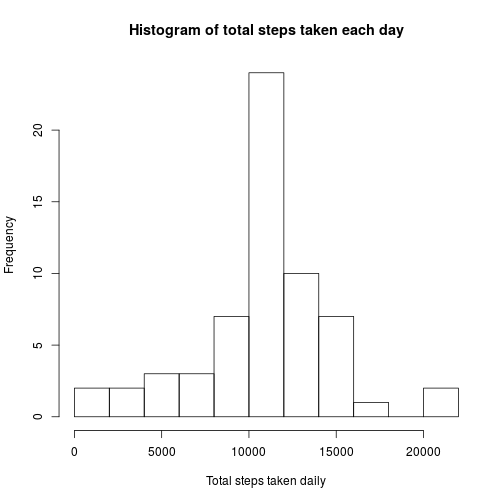
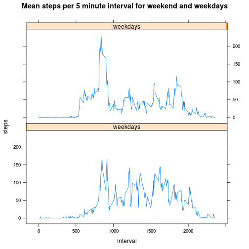

```r
library(ggplot2)
library(scales)
library(Hmisc)
```

```
## Loading required package: grid
## Loading required package: lattice
## Loading required package: survival
## Loading required package: splines
## Loading required package: Formula
## 
## Attaching package: 'Hmisc'
## 
## The following objects are masked from 'package:base':
## 
##     format.pval, round.POSIXt, trunc.POSIXt, units
```

```r
library(timeDate)
library(lattice)
```

```r
##Load the data

##Process/transform the data (if necessary) into a format suitable for your analysis
```

```r
data1<-read.csv("/home/praven/Dropbox/R Programming/activity.csv")
```

```r
##Calculate the total number of steps taken per day
```

```r
total_steps<-aggregate(steps~date,data=data1,sum,na.action = na.omit)
```

```r
##Make a histogram of the total number of steps taken each day
```

```r
hist(total_steps$steps,breaks=10,xlab="Total steps taken daily",main="Histogram of total steps taken each day")
```

 

```r
##Calculate and report the mean and median of the total number of steps taken per day
```

```r
mean(total_steps$steps)
```

```
## [1] 10766.19
```

```r
median(total_steps$steps)
```

```
## [1] 10765
```

```r
##Make a time series plot (i.e. type = "l") of the 5-minute interval (x-axis) and the average number of steps taken, averaged across all days (y-axis)
```

```r
total_steps_interval<-aggregate(steps~interval,data=data1,FUN=mean,na.action = na.omit)
```

```r
##Which 5-minute interval, on average across all the days in the dataset, contains the maximum number of steps?
```

```r
plot(total_steps_interval$interval,total_steps_interval$steps,type="l")
```

 

```r
total_steps_interval[which.max(total_steps_interval$steps), ]
```

```
##     interval    steps
## 104      835 206.1698
```

```r
##Calculate and report the total number of missing values in the dataset (i.e. the total number of rows with NAs)
```

```r
sum(is.na(data1))
```

```
## [1] 2304
```

```r
##Devise a strategy for filling in all of the missing values in the dataset. The strategy does not need to be sophisticated. For example, you could use the mean/median for that day, or the mean for that 5-minute interval, etc.

##Create a new dataset that is equal to the original dataset but with the missing data filled in.
```

```r
imputed_data <- transform(data1, steps = ifelse(is.na(data1$steps), total_steps_interval$steps[match(data1$interval, total_steps_interval$interval)], data1$steps))
```

```r
##Make a histogram of the total number of steps taken each day and Calculate and report the mean and median total number of steps taken per day. Do these values differ from the estimates from the first part of the assignment? What is the impact of imputing missing data on the estimates of the total daily number of steps?
```

```r
total_steps1<-aggregate(steps~date,data=imputed_data,sum,na.action = na.omit)
hist(total_steps1$steps,breaks=10,xlab="Total steps taken daily",main="Histogram of total steps taken each day")
```

 

```r
mean(total_steps1$steps)
```

```
## [1] 10766.19
```

```r
median(total_steps1$steps)
```

```
## [1] 10766.19
```

```r
##Create a new factor variable in the dataset with two levels – “weekday” and “weekend” indicating whether a given date is a weekday or weekend day.
```

```r
imputed_data$weekdays<-isWeekday(imputed_data$date,wday=1:5)
for(i in 1:nrow(imputed_data)) {
  if(isWeekday(as.Date(imputed_data[i,2]),wday=1:5)) imputed_data[i,4]<-1 else imputed_data[i,4]<-0
}
```

```r
##Make a panel plot containing a time series plot (i.e. type = "l") of the 5-minute interval (x-axis) and the average number of steps taken, averaged across all weekday days or weekend days (y-axis). See the README file in the GitHub repository to see an example of what this plot should look like using simulated data.
```

```r
imputed_data_interval<-aggregate(steps~interval+weekdays,data=imputed_data,FUN=mean)

xyplot(steps~interval |weekdays,data=imputed_data_interval,type='l',main="Mean steps per 5 minute interval for weekend and weekdays",layout=c(1,2),xlab="interval",ylab="steps")
```

 

